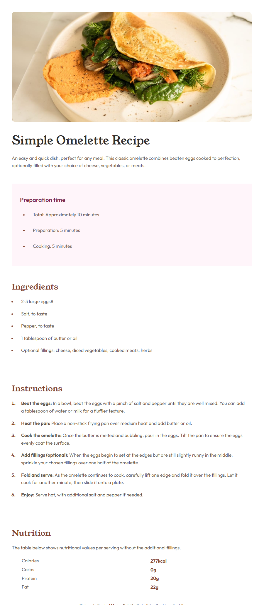

# Frontend Mentor - Recipe page solution

This is a solution to the [Recipe page challenge on Frontend Mentor](https://www.frontendmentor.io/challenges/recipe-page-KiTsR8QQKm). Frontend Mentor challenges help you improve your coding skills by building realistic projects. 

## Table of contents

- [Overview](#overview)
  - [Screenshot](#screenshot)
  - [Links](#links)
- [My process](#my-process)
  - [Built with](#built-with)
- [Author](#author)

## Overview

Recipe Page created as a solution for Frontend Mentor Challenge

### Screenshot

### Links

- Solution Repository URL: [https://github.com/felipesandoli/recipe-page-main](https://github.com/felipesandoli/recipe-page-main)
- Live Site URL: [https://felipesandoli.github.io/recipe-page-main/](https://felipesandoli.github.io/recipe-page-main/)

## My process

### Built with

- Semantic HTML5 markup
- CSS custom properties

## Author

- Linkedin - [Carlos Felipe Capobianco Sandoli](https://www.linkedin.com/in/felipesandoli/)
- Frontend Mentor - [@felipesandoli](https://www.frontendmentor.io/profile/felipesandoli)
